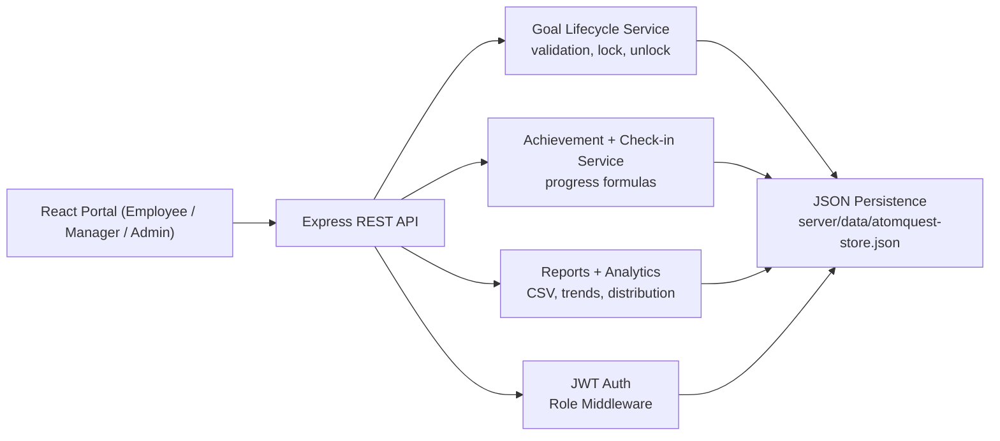

# Architecture

## Technology Choices

- Frontend: Vite + React for fast local demo and role-specific dashboards.
- Backend: Express REST API with JWT authentication and role middleware.
- Persistence: file-backed JSON store for low-cost hackathon hosting and reliable local demos.
- Reporting: server-generated CSV export from the same governed data model.
- Governance: audit log records goal submissions, approvals, inline edits, unlocks, shared KPI pushes, achievements, and check-ins.

## Hosting Path

For a hackathon demo, deploy the server and built client together on a small Node host. The JSON store keeps infrastructure cost low. For production, swap `server/src/data/store.js` with MongoDB/PostgreSQL while preserving route and service contracts.
